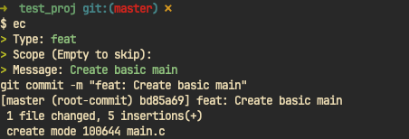

# Easy commit

A simple cli tool to git-commit with the [Conventional Commits](https://www.conventionalcommits.org/en/v1.0.0/) format.

## Example



## Install

1. Clone this repository

```bash
$ git clone https://github.com/Yohannfra/easy_commit
```

2. Install locally

```bash
$ cargo install --path .
```

## Usage

Just enter the ```ec``` command.

```
$ ec --help
Usage: ec [OPTIONS]

Options:
      --no-verify  Skip hooks
      --dry-run    man git-commit --try-run (Don't actually create the commit)
  -h, --help       Print help
  -V, --version    Print version
```

1. Select commit type (feat, fix, docs ...)
2. Enter *optional* scope
3. Enter commit message

That's all, the commit will be created with the [Conventional Commits](https://www.conventionalcommits.org/) format.

## License

[MIT](./LICENSE)

## Similar tool and inspiration for this project

- https://github.com/leegeunhyeok/easy-commit
